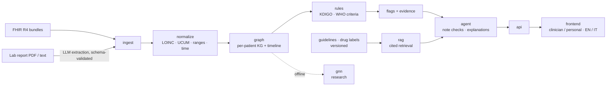

# Architecture

This page gives the planned shape of the system. Each module's details are settled in its phase and recorded in `docs/decisions/`.

## Data flow

## Modules

| Module | Responsibility | LLM allowed? |
| --- | --- | --- |
| `ingest` | Parse FHIR bundles and uploaded reports into typed models; keep a reference to each source. | Only for free-text/PDF extraction, validated against the schema |
| `normalize` | LOINC mapping, UCUM units and conversions, reference ranges, timestamps. | No |
| `graph` | Deterministic per-patient graph with typed edges (each with its basis), timeline, invariant checks, SQLite store and an offline HTML viewer (ADR 0005). | No |
| `rules` | Guideline criteria as code (KDIGO 2024, KDIGO 2012, WHO 2024; CKD-EPI 2021) and drug-label rules (DailyMed), each citing a quoted source that is checked against the stored text; flags carry their evidence (ADR 0006, 0007). | No |
| `rag` | Knowledge store of pinned guidelines and DailyMed labels; quote verification; passages with stable IDs; hybrid BM25 + bge-m3 retrieval with deterministic rank fusion (ADR 0007). | Embeddings only |
| `agent` | Check whether notes acknowledge a finding; explanations in two registers and two languages. | Yes: language only, grounded in cited chunks |
| `api` | FastAPI endpoints for ingest, graph, flags and explanations. | No |
| `gnn` | Future-diagnosis and missing-link prediction, compared against baselines. | No |

## Traceability

Everything the system asserts can be traced back to its evidence:

- A **flag** references the observations, conditions and medications it rests on (resource ID, value, unit, date) and the rule version that raised it.
- An **explanation** references the retrieved chunks it paraphrases (source, version, chunk ID). Sentences without support are dropped rather than shown.
- Uncertainty and data gaps are stated, not hidden. For example: "only one eGFR value; persistence can't be assessed."
